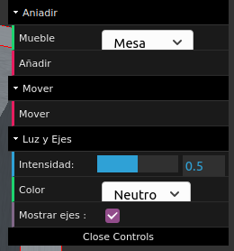

# Room 3D: Manual de usuario

> Por: Ana Buendía Ruiz-Azuaga

## ¿Qué es?

Room3D es una aplicación para diseño de habitaciones de interior. Podrás elegir entre distintos muebles, añadirlos, moverlos, rotarlos y colocarlos a tu gusto para crear una habitación. ¡Diviértete creando!

## ¿Cómo se usa?

Los controles son simples, y los dividiremos en varias secciones:

### Controles de cámara

Para mover la cámara debes mantener pulsada la tecla `Control`. Mientras la mantienes pulsada, podrás:

- Rotar la cámara: Con click izquierdo en el ratón y arrastrando la cámara rota.
- Desplazar la cámara: Con click derecho en el ratón y arrastrando la cámara se desplaza.

Una vez dejes de pulsar `Control` dejarás de controlar la cámara automáticamente.

Podrás mover la cámara en cualquier momento pulsando `Control`.

### Controles de la aplicación

En la esquina superior derecha de la aplicación encontramos un menú como este:

Nuestra aplicación empieza con unos muebles de ejemplo, la aplicación tiene dos modos: Añadir y Mover. Empezamos en el modo mover.

#### Mover

El modo mover se activa clicando en la opción `Mover` con borde rojo a la izquierda en el menú.

En este modo podemos seleccionar, desplazar, rotar y eliminar muebles.

- Seleccionar: Para seleccionar un mueble, simplemente hacemos click sobre el mueble. El resto de acciones se harán sobre el mueble seleccionado.
- Desplazar: Para desplazar el mueble por la habitación usaremos las teclas `wasd` para movernos en todas las direcciones.
- Rotar: Para rotar un mueble sobre sí mismo usaremos las teclas `qr` para rotar a izquierda y derecha.
- Eliminar: Para eliminar un mueble usamos la tecla `r`. Después de eliminar un mueble debemos seleccionar otro.

Aclaración: Un mueble puede desplazarse o rotar si al hacerlo no choca con otro mueble. En caso de que al moverlo o rotar chocase, el mueble no realizará la acción.

Aclaración 2: Un mueble que tiene otro mueble encima no puede desplazarse, rotar ni eliminarse.

#### Añadir

El modo añadir se activa pulsando la opción `Añadir` con borde rojo a la izquierda en el menú. Se selecciona el tipo de mueble a añadir en el desplegable de encima, donde se muestran todos los muebles disponibles.

Para añadir el mueble a la habitación simplemente se hace click en el lugar donde se desea añadir el mueble. Si el mueble está demasiado cerca de otro mueble (esto es, chocan), el mueble no se añadirá.

Para mover los muebles añadidos debe volverse al modo mover y seleccionar el mueble deseado.

#### Controles de la luz y ejes

Desde este panel podemos controlar distintas cosas:

- Intensidad de la luz: Desplazando la barra azul podemos controlar la intensidad de la luz en la habitación.
- Color de la luz: Podemos elegir el color ambiente de la luz en la habitación eligiendo uno de esos colores en el desplegable.
- Mostrar ejes: Podemos mostrar o no los ejes marcando en Mostrar Ejes.

#### Sobre los muebles....

Un mueble puede permitir que haya otros muebles encima suyo (como las mesas y cajonera), pero no todos los muebles pueden ponerse encima de otros. Algunos que sí pueden estar encima de otros son las tazas y lámparas.

